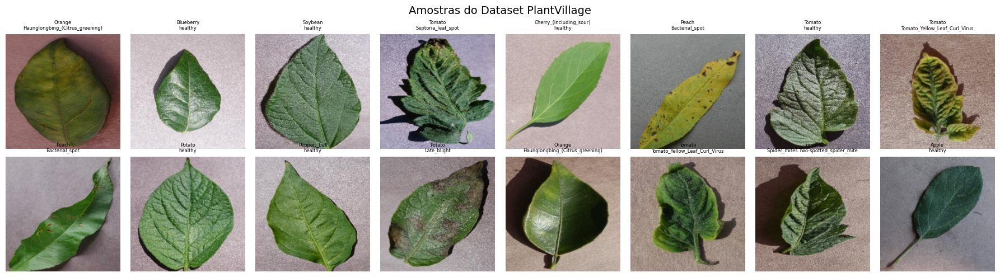
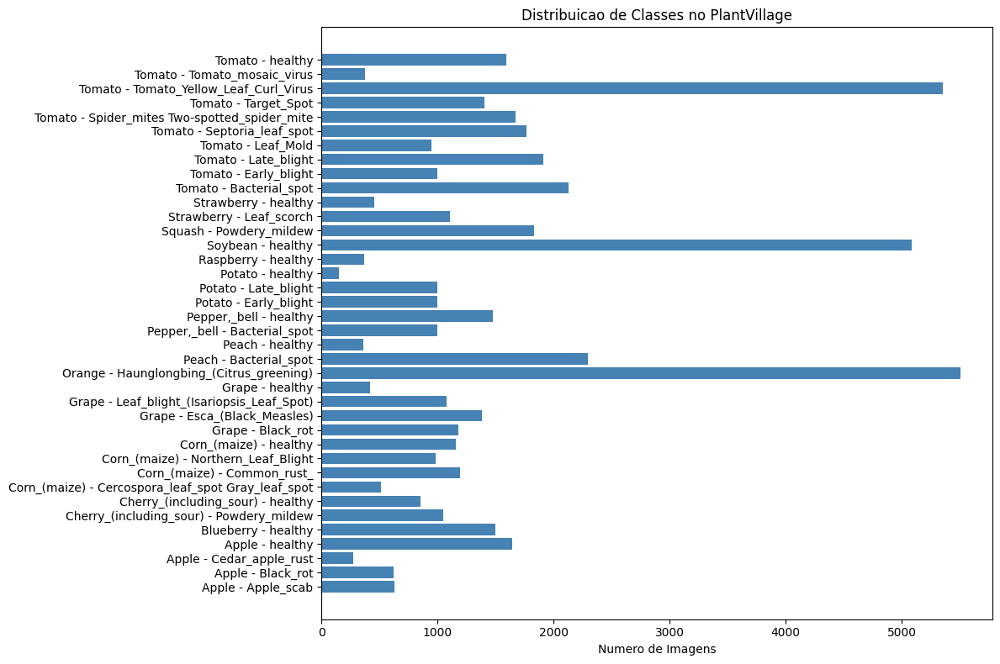
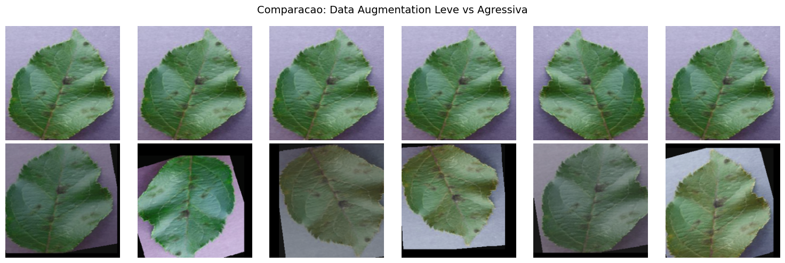
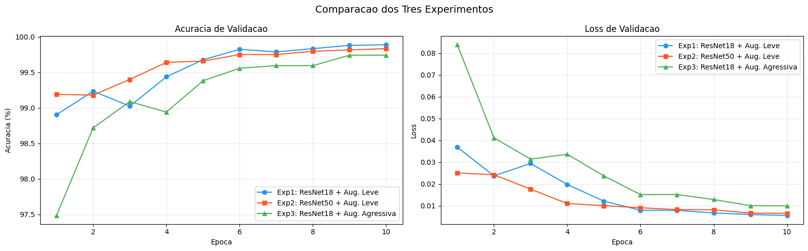
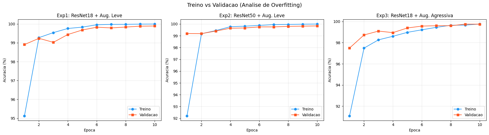

Aluno: Thomaz Ritter

## 1. Introdução

Minha mãe tem um pátio grande em casa e cultiva várias plantas, incluindo orquídeas. Ela estuda as plantas (comprou um livro sobre recentemente), e convivendo com isso percebi o quanto é difícil identificar problemas só olhando pra folha. Hoje em dia ela utiliza alguns apps já existentes para detectar problemas nas folhas/plantas… no entanto, antigamente ela utilizava apenas a pesquisa no Google, o que acabava ficando difícil.

Quando li o desafio, percebi que poderia tentar montar um sistema local, que ela pudesse utilizar… sem precisar usar algum app pago/existente. Esta área está em constante evolução e temos datasets ricos em features.

Se comentarmos sobre a agricultura como um todo, ela representa cerca de 23% do PIB brasileiro (CEPEA/CNA, 2024), e a FAO estima que pragas e doenças causem perdas de até 40% da produção global de alimentos por ano (IPPC/FAO). O diagnóstico tradicional depende de agrônomos especializados, o que funciona para grandes propriedades, porém deixa pequenos agricultores sem acesso a esse tipo de suporte.

Neste trabalho, foi feito um sistema de classificação de doenças em plantas usando o dataset PlantVillage, que contém 54 mil imagens de folhas, organizadas em 38 categorias. Comparei três abordagens para entender os trade-offs entre arquiteturas diferentes e técnicas de aumento de dados.

## 2. Definição do Problema

**O que o modelo precisa fazer:** receber uma foto de uma folha e dizer, entre 38 opções, se a planta está saudável ou qual doença ela tem.

Isso refere-se a um problema de **classificação multi-classe**. A entrada é uma imagem RGB e a saída é uma entre 38 classes possíveis.

### Por que usar redes neurais convolucionais (CNNs)?

Em vez de jogarmos pixels independentes em uma rede conectada, CNNs resolvem isso com filtros convolucionais, ou seja, pequenas janelas (tipicamente 3x3 ou 5x5 pixels) que se movimentam pela imagem detectando padrões. As primeiras camadas aprendem coisas simples como bordas e texturas. Camadas intermediárias combinam essas features em padrões mais complexos, como curvas. As camadas finais reconhecem estruturas de alto nível, como formato da folha e padrões de manchas.

Cada camada convolucional produz **feature maps**, ou seja, ativações que indicam onde na imagem cada padrão foi detectado. Além das convoluções, CNNs usam **Max Pooling** para reduzir a dimensionalidade espacial e funções de ativação como **ReLU** para introduzir não-linearidade.

Essa estrutura encaixa bem no nosso problema, onde uma mancha bacteriana tem textura e formato diferente de ferrugem ou míldio. É por isso que vou utilizar CNNs.

### Por que usar transfer learning?

Treinar uma CNN do zero para 38 classes com ~54 mil imagens seria sim possível, mas podemos utilizar de transfer learning para cortar o caminho.

A ideia do transfer learning é reutilizar uma rede já treinada e trocar a última camada (que faz a classificação final) para ter 38 saídas em vez de 1000.

O resultado é que a rede já "sabe ver" imagens, e só precisa aprender a distinguir as nossas 38 classes específicas. Isso reduz bastante o tempo de treinamento e funciona bem mesmo com datasets menores.

Em aula vimos três estratégias de fine-tuning: **Feature Extraction** (congela tudo, treina só o classificador final), **Fine-tuning Parcial** (congela camadas iniciais, treina as finais) e **Fine-tuning Completo** (treina tudo com learning rate menor). Optei por fine-tuning completo com LR de 1e-4. Escolhi esse valor por ser baixo o suficiente para não destruir os pesos pré-treinados, porém permite que todas as camadas se adaptem ao domínio.

### Por que ResNet especificamente?

A família ResNet (He et al., 2016) introduziu uma inovação interessante, que são as **conexões residuais**. Em redes muito profundas, o sinal tende a se perder conforme passa por várias camadas, visto que o gradiente vai encolhendo. Isso seria o vanishing gradient. As conexões residuais criam "atalhos" que permitem o sinal pular camadas, resolvendo esse problema.

Escolhi comparar duas versões:
- **ResNet18** (11.7 milhões de parâmetros): mais leve e treina rápido
- **ResNet50** (25.6 milhões de parâmetros): mais profunda e maior capacidade. Como visto em aula, a ResNet50 seria um ponto legal para transfer learning

O objetivo aqui é avaliar um trade-off: mais parâmetros sempre significam melhores resultados? Nem sempre. Um modelo maior pode memorizar os dados de treino (overfitting) em vez de aprender padrões que generalizem. Vamos ver isso nos resultados em seguida.

### E por que não usar Transformers?

Em aula vimos os **Transformers**, originalmente criados para processamento de linguagem natural, mas que também podem ser aplicados a visão computacional. O **Vision Transformer (ViT)** divide a imagem em pequenos pedaços e trata cada pedaço como um "token", aplicando o mecanismo de **self-attention** para aprender relações entre regiões distantes da imagem.

Transformers têm uma vantagem teórica, onde o mecanismo de atenção consegue capturar relações globais na imagem desde a primeira camada. CNNs precisam empilhar muitas camadas convolucionais para que o campo receptivo cubra a imagem inteira, logo ficam limitadas no começo.

Se fizermos uma tabela para comparação:

|  | ViT | CNN |
| --- | --- | --- |
| Atenção | Global desde a primeira camada | Receptive field cresce gradualmente |
| Dados | Precisa de mais dados para treinar bem | Inductive bias ajuda com poucos dados |
| Escala | Melhora com mais dados/compute | Mais eficiente em escala menor |

Então por que optei por CNNs neste projeto? Seguem algumas razões:

1. ViTs precisam de mais dados, e o PlantVillage que usamos tem 54k imagens, que acabou ficando mais confortável para CNNs.
2. ViT demoraria muito mais por causa do self-attention, que tem complexidade quadrática em relação ao número de pedaços.
3. CNNs têm um viés indutivo natural para imagens (localidade, invariância a translação) que ViTs precisam aprender dos dados. Com poucos dados, esse viés acaba se tornando uma vantagem.

Nos trabalhos futuros, uma comparação direta CNN vs ViT neste dataset seria um teste interessante.

## 3. Metodologia

### 3.1 Dataset

O PlantVillage (Hughes & Salathe, 2015) possui 54k imagens de folhas fotografadas em condições controladas de laboratório, onde o fundo é uniforme e a iluminação padronizada. São 38 classes cobrindo 14 espécies de plantas, incluindo tomate, batata, milho, uva e maçã. Cada classe representa uma combinação de planta + condição (saudável ou doença específica).

Alguns exemplos de classes:
- `Tomato___Late_blight` (tomate com requeima)
- `Potato___healthy` (batata saudável)
- `Apple___Cedar_apple_rust` (maçã com ferrugem)

Abaixo, algumas amostras do dataset:



No entanto, o dataset tem um problema, que é a distribuição não ser uniforme. Algumas classes têm cerca de 5.000 imagens enquanto outras têm menos de 500. Isso pode introduzir um viés, visto que o modelo pode "preferir" predizer classes com mais exemplos.



### 3.2 Pré-processamento

Todas as imagens são redimensionadas para 224x224 pixels (o tamanho que ResNet espera) e normalizadas com a média e desvio padrão do ImageNet. Como visto em aula, é fundamental usarmos a mesma normalização do pré-treinamento. O dataset é dividido em 80% treino (por volta de 43k imagens) e 20% validação (em torno de 10k), com **seed fixa** (42) para reprodutibilidade. Por fim, data augmentation é aplicada apenas no treino, nunca na validação.

### 3.3 Configuração de Treinamento

- **Loss function:** CrossEntropyLoss. Ela mede o quão distante a distribuição de probabilidades prevista pelo modelo está da resposta correta.
- **Otimizador:** Adam com learning rate de 0.0001. Escolhi Adam porque ele adapta o learning rate individualmente para cada parâmetro, convergindo mais rápido que SGD em muitos casos.
- **Scheduler:** CosineAnnealingLR, que diminui o learning rate ao longo das épocas seguindo uma curva de cosseno. Isso ajuda o modelo a fazer ajustes mais finos nas últimas épocas.
- **Épocas:** 10. Com transfer learning, o modelo já começa com bons pesos e não precisa de muitas épocas para convergir.
- **Batch size:** 64 imagens por vez.

### 3.4 Três Experimentos

Desenhei três experimentos que isolam variáveis diferentes:

| Experimento | Arquitetura | Data Augmentation | Testando: |
| --- | --- | --- | --- |
| 1 | ResNet18 | Leve (HorizontalFlip) | Baseline |
| 2 | ResNet50 | Leve (HorizontalFlip) | Modelo mais profundo melhora? |
| 3 | ResNet18 | Agressiva | Mais augmentation melhora? |

**Data augmentation** é uma técnica para artificialmente aumentar a variedade dos dados de treino aplicando transformações aleatórias nas imagens. A ideia é que o modelo veja a "mesma" folha em ângulos, iluminações e posições diferentes, aprendendo a ser robusto a essas variações.

No Experimento 1 e 2, uso apenas `RandomHorizontalFlip` (espelhar horizontalmente com 50% de chance), algo leve que não distorce muito a imagem.

No Experimento 3, um conjunto mais agressivo:
- Flip horizontal e vertical
- Rotação aleatória de até 30 graus
- Variação de brilho, contraste, saturação e matiz
- Translação e escala aleatórias

Resumindo, augmentation forte pode ajudar o modelo a generalizar melhor (especialmente para imagens reais de campo), porém torna o treinamento mais difícil porque cada imagem aparece de forma diferente a cada época.



## 4. Resultados

### 4.1 Tabela Comparativa

| Experimento | Parâmetros | Acc. Treino | Acc. Validação | Loss Val. |
| --- | --- | --- | --- | --- |
| ResNet18 + Aug. Leve | 11.7M | 99.99% | **99.89%** | 0.0055 |
| ResNet50 + Aug. Leve | 25.6M | 99.99% | 99.83% | 0.0065 |
| ResNet18 + Aug. Agressiva | 11.7M | 99.75% | 99.74% | 0.0099 |

O melhor resultado foi da **ResNet18 com augmentation leve**, alcançando 99.89% de acurácia na validação. A ResNet50, mesmo com o dobro de parâmetros, ficou ligeiramente abaixo (99.83%). A augmentation agressiva reduziu a acurácia final pra 99.74%, porém com um gap treino-validação menor (0.01% vs 0.10%).

### 4.2 Curvas de Aprendizado

As curvas de acurácia e loss ao longo das 10 épocas mostram três coisas:

- **Velocidade de convergência:** quantas épocas o modelo precisa para "estabilizar". Com transfer learning, a convergência é rápida, visto que já na primeira época a acurácia ultrapassa 95%.
- **Overfitting:** se existe um gap entre a acurácia de treino e de validação. Um gap grande significa que o modelo está memorizando os dados em vez de aprender padrões.
- **Estabilidade:** se a curva de validação oscila muito ou converge de forma suave.



Nos três experimentos, a convergência foi rápida: já na primeira época a acurácia de validação ultrapassou 95%. A ResNet18 e ResNet50 com augmentation leve convergiram de forma suave, praticamente estabilizando a partir da época 6. A ResNet18 com augmentation agressiva convergiu mais devagar (91% na primeira época vs 95% das outras), o que faz sentido visto que as imagens transformadas são mais difíceis de classificar.



### 4.3 Análise por Classe

O classification report e a matriz de confusão do melhor modelo estão no notebook. As métricas por classe (precision, recall, F1-score) mostram onde o modelo erra mais.

Os detalhes por classe estão no notebook. De forma geral, as classes com pior desempenho são doenças visualmente similares dentro da mesma espécie (ex: diferentes doenças de tomate), algo que será discutido na seção 5.3.

## 5. Análise e Trade-offs

### 5.1 ResNet18 vs ResNet50: mais profundo é melhor?

A ResNet50 tem o dobro dos parâmetros da ResNet18. Em teoria, mais parâmetros significam mais capacidade de aprender padrões. Porém existe um limite, e que se o dataset não é grande ou variado o suficiente, esses parâmetros extras acabam memorizando ruído em vez de padrões úteis. Isso acaba se tornando overfitting.

Além disso, mais parâmetros significam mais tempo de treinamento por época (a ResNet50 leva quase o dobro), mais memória GPU necessária e um modelo maior para servir em produção.

Nos resultados, a ResNet18 (99.89%) superou a ResNet50 (99.83%). Ambas atingiram 99.99% no treino, porém a ResNet50 generalizou ligeiramente pior. Isso confirma que, para este dataset, a capacidade extra da ResNet50 não traz benefício. O gap treino-validação foi similar (0.10% vs 0.16%), indicando que nenhum dos dois modelos sofreu de overfitting severo.

Na prática, a ResNet18 é a melhor escolha aqui: treina em metade do tempo, ocupa metade da memória e tem acurácia superior. Um modelo menor que roda no celular do usuário pode ter mais impacto do que um modelo enorme que precisa de um servidor.

### 5.2 Data augmentation: quanto é suficiente?

A augmentation forte simula condições que o modelo encontraria no mundo real, que seriam folhas fotografadas tortas, com sombra, em dias nublados. O PlantVillage foi capturado em laboratório com condições perfeitas. Logo, sem augmentation o modelo aprende a classificar folhas em condições perfeitas e pode falhar quando encontrar uma foto tirada com celular.

- **Sem augmentation:** treina rápido, acurácia alta no dataset, porém pode falhar no mundo real
- **Com augmentation:** treina mais devagar, acurácia de treino mais baixa, porém possivelmente mais robusto

Nos resultados, o gap treino-validação do Exp1 (sem augmentation forte) foi de 0.10% (99.99% treino vs 99.89% validação). No Exp3 (com augmentation agressiva), o gap caiu pra 0.01% (99.75% vs 99.74%). Ou seja, a augmentation forte cumpriu o papel de reduzir overfitting. Porém, a acurácia final ficou 0.15% abaixo do Exp1. Isso faz sentido: o PlantVillage já tem imagens padronizadas, então a augmentation extra acaba dificultando o treino sem benefício claro na validação. Em um dataset com fotos reais de campo, o resultado provavelmente seria diferente.

### 5.3 Onde o modelo acaba errando?

As classes com pior F1-score tipicamente envolvem doenças visualmente parecidas na mesma espécie. Por exemplo, as diferentes doenças de tomate (mancha bacteriana, septória, míldio) podem ter sintomas bastante similares nas folhas. Até mesmo especialistas humanos precisam de análise laboratorial para distinguir alguns desses casos.

Outra fonte de erro seria a confusão entre folhas saudáveis de espécies diferentes. A textura base de muitas folhas é similar, e por isso o modelo pode se confundir quando a única pista é a espécie e não a presença de doença.

Os exemplos concretos de acertos e erros, junto com a matriz de confusão completa, estão no notebook.

### 5.4 Limitações

Abaixo algumas limitações do trabalho:

1. **Dataset controlado.** As fotos do PlantVillage foram tiradas em laboratório com fundo uniforme. No mundo real, a foto teria solo, outras plantas e sombras. A folha pode não estar centralizada. Isso significa que a acurácia de 99% não se traduz diretamente para 99% no mundo real.
2. **Desbalanceamento de classes.** Algumas doenças têm 5x mais imagens que outras. O modelo pode ter aprendido a "chutar" classes com mais exemplos quando está em dúvida.
3. **Cobertura limitada.** O dataset cobre 38 combinações de planta+doença, porém existem centenas de doenças de plantas.
4. **Apenas folhas isoladas.** Cada imagem contém uma única folha, o que não reflete o uso onde o usuário fotografaria a planta inteira.

## 6. Como colocar em produção

Em aula olhamos o ciclo completo de deployment: APIs, containers e monitoramento de inferência. Treinar o modelo é metade do trabalho. A outra metade é tornar ele acessível e confiável em produção. Abaixo alguns itens que são importantes ao fazer deploy:

### 6.1 API REST

Podemos utilizar FastAPI por ser rápido e tipado. O endpoint recebe uma foto e retorna a predição com a confiança. O modelo é carregado na inicialização (não a cada requisição) e um endpoint `/health` permite verificar se o serviço está no ar.

```
POST /api/v1/predict
Content-Type: multipart/form-data
Body: image=<foto_da_folha.jpg>

Response: {
    "classe": "Tomato___Late_blight",
    "confianca": 0.97,
    "planta": "Tomate",
    "doenca": "Requeima",
    "saudavel": false
}
```

O modelo seria serializado com `torch.save()` e carregado no startup. Com **Docker** (usando imagem slim como base), o deploy fica reproduzível. Um `docker-compose.yml` orquestraria a API junto com **Prometheus** para coleta de métricas como latência de predição e distribuição de classes preditas, permitindo detectar anomalias em produção.

### 6.2 Inferência otimizada

Durante o treinamento, precisamos calcular gradientes e atualizar pesos. Na inferência, só precisamos do forward pass. É por isso que existem otimizações específicas para servir modelos:

- **TorchScript / ONNX:** converter o modelo para um formato otimizado que não depende de Python em runtime, reduzindo latência.
- **Batching de requisições:** acumular várias imagens e processar de uma vez na GPU, aumentando o throughput.
- **Quantização:** converter pesos de float32 para int8, reduzindo o modelo de ~44MB para ~11MB. Isso viabiliza rodar no celular do usuário sem depender de internet.

### 6.3 Monitoramento

Em produção, precisaríamos monitorar:

- **Data drift:** as fotos dos usuários são parecidas com o treino? O PlantVillage tem fundo uniforme. Se começarem a chegar fotos com fundo complexo, a acurácia vai cair e precisamos detectar isso.
- **Latência de inferência:** garantir tempos de resposta abaixo de 500ms para boa experiência do usuário.
- **Feedback loop:** permitir que usuários corrijam predições erradas, gerando dados rotulados para retreinamento periódico do modelo.

## 7. Conclusão

Este projeto demonstrou que transfer learning com CNNs é uma abordagem eficaz para classificação de doenças em plantas, alcançando acurácias de validação acima de 99% no PlantVillage. Os três experimentos permitiram analisar trade-offs práticos entre profundidade da arquitetura e técnicas de data augmentation. Essas são decisões que todo profissional de IA precisa tomar no dia a dia.

O melhor modelo foi a ResNet18 com augmentation leve (99.89%), mostrando que pra este problema não precisamos de uma rede muito profunda. A augmentation agressiva reduziu overfitting mas não melhorou a acurácia final, provavelmente porque o PlantVillage já é um dataset controlado.

Como próximos passos, seria interessante: (1) testar com datasets de imagens reais de campo como o PlantDoc; (2) incluir mais espécies, como orquídeas, que têm relevância pessoal e comercial; (3) explorar Vision Transformers (ViT) como alternativa às CNNs; e (4) construir um protótipo mobile para validar o uso por agricultores reais.

## Referências

1. Hughes, D. P., & Salathe, M. (2015). An open access repository of images on plant health to enable the development of mobile disease diagnostics. *arXiv preprint arXiv:1511.08060*.
2. He, K., Zhang, X., Ren, S., & Sun, J. (2016). Deep residual learning for image recognition. *Proceedings of the IEEE Conference on Computer Vision and Pattern Recognition (CVPR)*, 770-778.
3. Mohanty, S. P., Hughes, D. P., & Salathe, M. (2016). Using deep learning for image-based plant disease detection. *Frontiers in Plant Science*, 7, 1419.
4. Deng, J., Dong, W., Socher, R., Li, L. J., Li, K., & Fei-Fei, L. (2009). ImageNet: A large-scale hierarchical image database. *Proceedings of the IEEE Conference on Computer Vision and Pattern Recognition (CVPR)*, 248-255.
5. Loshchilov, I., & Hutter, F. (2016). SGDR: Stochastic gradient descent with warm restarts. *arXiv preprint arXiv:1608.03983*.
